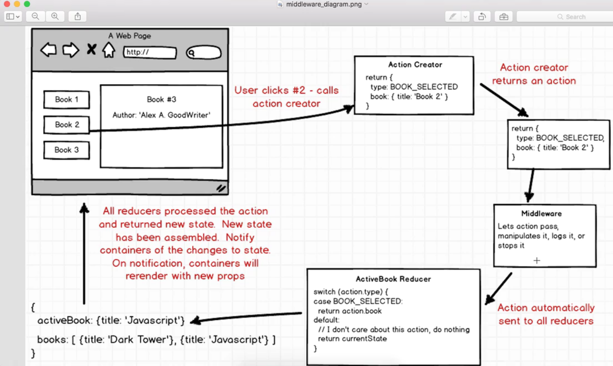

First the App calls => actionCreator

actionCreator returns => and action

action has to go through => middleware

middleware then submits data => Reducer

Reducer calls the 'glue' and creates => global app state

-we can have 0 or even 100 middlewares (totally optional)

* We have install AXIOS for quick ajax calls.
* fetchWeather is a action that returns a:
  * type: FETCH_WEATHER
  * payload: request

We must connect this with redux now, for a App-wide access.
