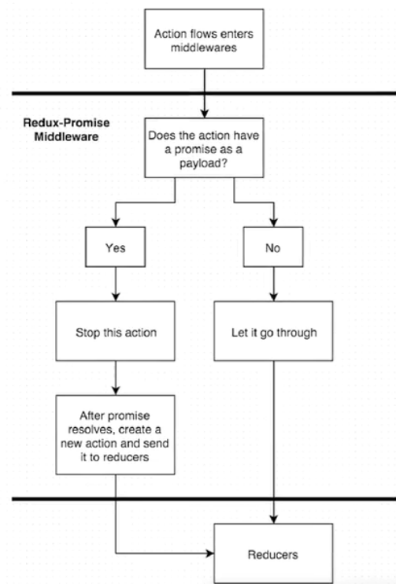

This reducer handles the fetchWeather action

reducers get two arguments: `state` and `action`
reducers also return 'state'

`Promise`: does not contain any of our data.

* User types in city | submit
* calls action creator that passes in city | fetchWeather
* craft url with city | make ajax request with Axios | Promise
* we return `request` on `payload` key

 
middleware ReduxPromise
* stops the promise / action in its track until resolved

