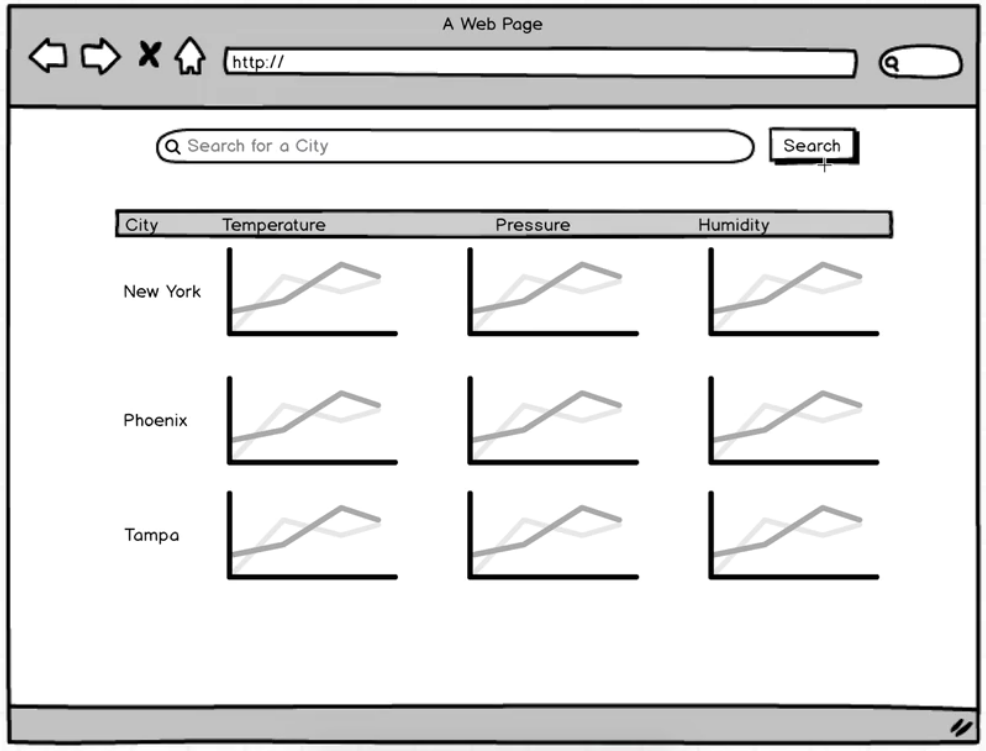
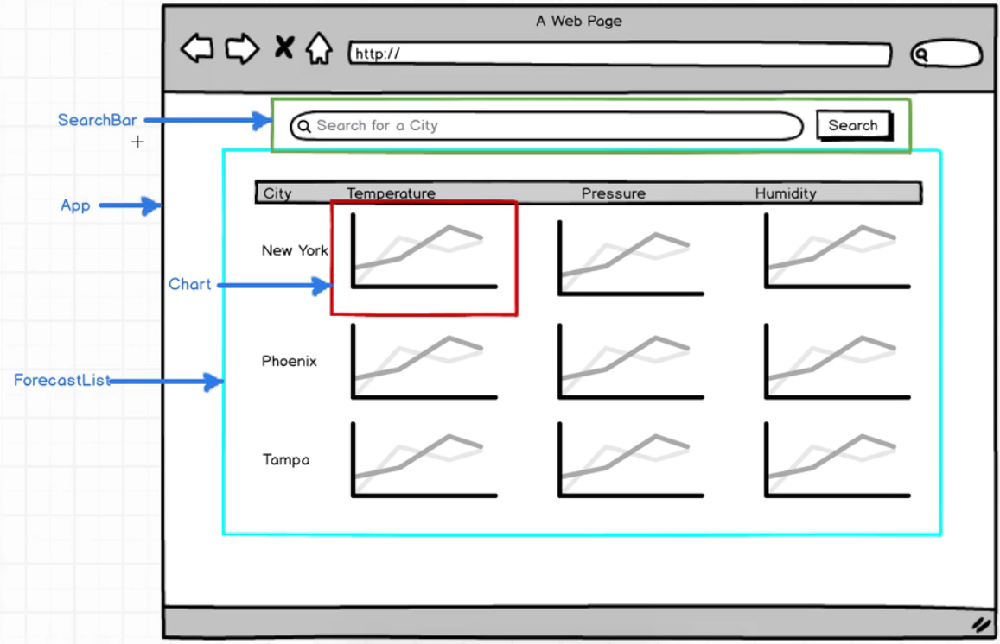

# Weather forecast Browser - 5 Weather Statistics

### This project
* Solidify knowledge of React
* More familiar with Redux
* Learn to make asynchronous calls with Redux

* A user can search for a city and submit
  + submit a query to a 3rd party API
* with data it adds a row on table with info about that city.
* with each search it adds an additional row
* Columns
  + city name
  * temp
  * pressure
  * humidity

#### Challenges
* Ajax request with Redux
  * centralize all logic into reducers and actions
  * React components are only responsible for displaying data
* The line chart
  * 3rd party libray to draw lines
* Dealing with Redux app where state changes significantly over time

### Planning

* SearchBar: with submit
  + shows search input and button
  + calls an actionCreator in Redux
* ForecastList:
  + instead of a List and ListItem, we can keep it simple
* Chart: single chart componetn for temp, pressure, humidity
  * 3rd party graphic
* App is entire container:
  + kind of the glue component
